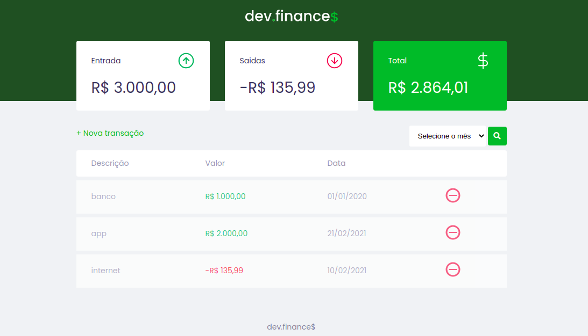

# Dev-Finance

  [](http://github.com/stilljag/dev-finance/blob/master/LICENSE.md)

## Aplicação

```bash
# Clone o repositório
$ git clone https://github.com/stilljag/dev-finance.git

# Acesse o diretório.
-> dev-finance/public/index.html

```

<hr>

<div align="center" style="margin-bottom: 20px;">

</div>

## Sobre

Esta aplicação foi desenvolvida durante a Maratona Discover da [Rocketseat][rock]

---

## Desenvolvimento

  

##### 📍 Criação da versão 1.0

##### 📘 Foi implementando a funcionalidade de filtro por mês; card total ficou estilizado para cor vermelha com o saldo fica negativo.

---

## Contribuição

1. Faça o _fork_ do projeto (<https://github.com/stilljag/dev-finance/fork>)
2. Crie uma _branch_ para sua modificação (`git checkout -b feature/fooBar`)
3. Faça o _commit_ (`git commit -am 'Add some fooBar'`)
4. _Push_ (`git push origin feature/fooBar`)
5. Crie um novo _Pull Request_

---

## Contatos

[](https://www.linkedin.com/in/william-ribeiro-0b5ab911a/) [](mailto:sbrdigital15@gmail.com)

---

### Licença

Este projeto é desenvolvido sob a licença MIT. Veja o arquivo [LICENSE](LICENSE.md) para saber mais detalhes.

[rock]: https://rocketseat.com.br/ "Rocketseat"
